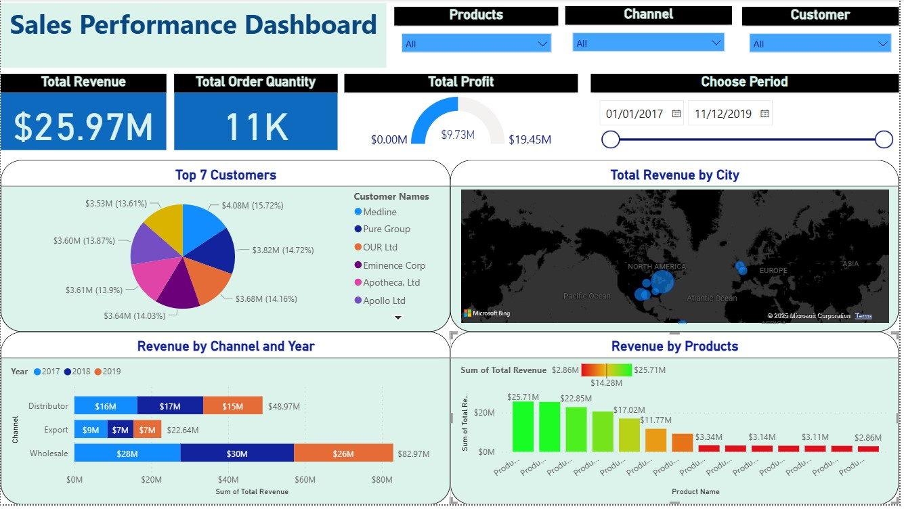

# 📊 Sales Performance Dashboard

This project presents a comprehensive Power BI dashboard that analyzes sales performance metrics using historical data sourced from Excel. The dashboard is designed to deliver actionable insights across various business dimensions such as customer performance, product trends, revenue distribution, sales channels, and regional performance.

---

## 🧩 Overview

The **Sales Performance Dashboard** provides an interactive analytical view of business performance across time, geography, and customer segments. It equips decision-makers with insights into sales distribution, top contributors, and performance trends using a variety of dynamic visualizations.

---

## 🔑 Key Components

### 📁 Data Source
- The data is imported from a structured **Excel file** containing the following sheets:

### 🗂️ Tables Used
- `customer_data`: Contains customer-related details.
- `products_data`: Contains product-level information.
- `regions_table`: Contains full address and location-based data.
- `sales_data`: Main fact table capturing order-level transactions (revenue, quantity, date, etc.).

### 🧱 Data Modeling
- Relationships established between:
  - `sales_data` ↔ `customer_data`
  - `sales_data` ↔ `products_data`
  - `sales_data` ↔ `regions_table`
- Applied a **star schema** model to optimize relationships and filtering.
- Developed **calculated columns and DAX**

---

## 📊 Dashboard Visualizations

### 📄 **Sales Performance Dashboard**

- **KPI Cards**:
  - 💰 Total Revenue  
  - 📦 Total Order Quantity  

- **Gauge**:
  - 🎯 Total Profit – displayed using a gauge visual for quick understanding of profit level.

- **Pie Chart**:
  - 👤 Top 7 Customers by Revenue – showing percentage contribution per customer.

- **Column Chart**:
  - 📦 Revenue by Product Name – Column chart to compare product-wise revenue.

- **Stacked Bar Chart**:
  - 🧱 Revenue by Channel and Year – comparing year-wise revenue across sales channels (e.g., Export, Wholesale, Distributor).

- **Map Visualization**:
  - 🌍 Total Revenue by City – using Bing Maps to represent geographical revenue distribution.

- **Slicers (Interactive Filters)**:
  - 📅 Date Range Selector
  - 👤 Customer
  - 🛍️ Product
  - 🌐 Channel

All visuals are interactive, enabling users to dynamically explore data by region, product, customer, and channel.

---

## 💡 Key Insights

- 💼 Identified the **top-performing customers** contributing the highest revenue through a pie chart.
- 📦 Analyzed **product-wise revenue** distribution to uncover leading and lagging products.
- 🛒 Evaluated **channel-wise revenue** trends across years to assess growth and decline.
- 🗺️ Used a **map** to visualize **city-level revenue performance**, highlighting key geographic contributors.
- 🔍 Enabled advanced filtering with slicers for deep-dive exploration of any customer, product, or channel.

---

